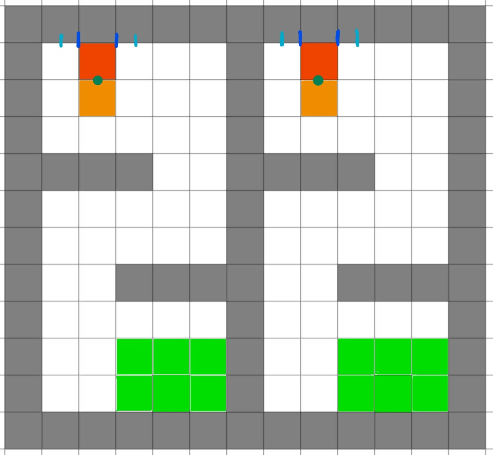

Lab X: Capstone Project
=======================

Overview
--------

Finally, we are going to work on the final capstone project.
Throughout the quarter, you should have already learned everything you need for this capstone demo.
Now, it's time to show off your skills!

We will make this a competition between teams. Details are shown as follows.

Submission
----------

#. Submission: group submission via iLearn, due 11:59pm Saturday Dec 7, 2019

#. Demo: required, please also record a video

#. Files to submit: **(please do not zip, just upload all files)**

   - capstone_report_01.pdf (replace 01 with your team number)
   - capstone.py
   - capstone.mp4 (**mp4 only, file size < 20MB, please compress**, 
     e.g., using `HandBrake <https://handbrake.fr/>`_)
  
#. Grading rubric:

   - \+ 20%  Lab report (including required figure) and recorded video.
   - \+ 20%  Able to start from any one of the six initial cells.
   - \+ 20%  Smoothness of the trajectory.
   - \+ 20%  Accuracy of kicking the ball.
   - \+ 20%  Speed (total time to complete the task).
   - \- 5% Penalty applies for any collision with obstacles or virtual walls. 
   - \+ 1-5% Bonus points for winners in the competition. 

Rubric Details
--------------

#. **\+ 20%** Lab report (including required figure) and recorded video.
   
   - A good lab report should be self-contained, sufficient, and also concise.
     Please ask yourself: Can someone else replicate my experiment just based on my report?
   - Please follow lab report template and fill out all sections.
   - Please include the figure of your trajectory.
   - At least two pages excluding appendix.
   - Video should be in mp4 format and less than 20MB in size. Please compress the video.

#. **\+ 20%** Able to start from any one of the six initial grids.
   
   - Do not hard code the starting point. It should be a flexible parameter.
   - You can have three trials during the demo, 
     from which the best one will be counted into your final score.
   - For each trial, I will randomly pick one from six possible grids.

#. **\+ 20%** Smoothness of the trajectory.

   - 20pts if smooth at all time
   - 18pts if minor sharp turns, acceleration/deceleration
   - 15pts if many sharp turns, acceleration/deceleration

#. **\+ 20%** Accuracy of kicking the ball.
   
   - 20pts if kick the ball to the narrow gate (marked by dark blue in the map)
   - 18pts if kick the ball to the wide gate (marked by light blue in the map)
   - 15pts if missing

#. **\+ 20%** Speed (total time to complete the task).

   - 20pts if complete in 30 seconds
   - 18pts if complete in 45 seconds
   - 16pts if complete in 60 seconds
   - 14pts if cannot complete in 60 seconds

#. **\- 5%**  Penalty applies for any collision with obstacles or virtual walls.

   - The robot has to aviod obstacles as well as virtual walls marked by tapes on the ground.
   - For example, after kicking the ball, the robot should stop smoothly and not run out of competition area,
     otherwise it will be counted as hitting the virtual wall.

#. **\+ 1-5%** Bonus points for winners in the competition. 
   
   - You will compete with each other across lab sections in two tracks: speed and accuracy.
   - Speed track will be evaluated by time (second)
   - Accuracy track will be evaluated by the distance to the center of gate (how many ball size)
   - 5pts for the 1st place
   - 3pts for the 2nd place
   - 2pts for the 3rd place

Field Map
---------

- We divide the space into two parts to accommodate more teams at the same time.
  They are designed to have exactly the same layout. 
  
- The grid size is **0.5m**, which is a bit larger than the size of the robot.

- The grey grids are obstacles and walls that the robot should not collide with.

- The six green grids on the bottom right corner are starting areas. 
  For each trial during the demo, one of them will be picked at random.

- On the top side, the red grid is the goal area where the robot should stop, 
  and the orange grid is the buffer area where the robot should pass through, in order to kick the ball.

- On the top side, the narrow gate is marked by dark blue color,
  and the wide gate is marked by light blue color.

- The ball is placed on the common edge of orange and red grid, marked by dark green color. 

Competition Rules
-----------------

#. Each team can have three trials for the final demo, from which we pick the best one to evaluate 
   the smoothness, accuracy, and speed.

#. For each trial, the robot will start from one of the six starting grids, plan and follow
   its smooth trajectory, pass the orange grid to kick the ball, and stop at the red grid (in front of gate).

#. The robot should have a reasonable velocity when passing through orange grid into red grid,
   in order to kick the ball.
   Points will be deducted if the robot does not stop and collides with the wall.

