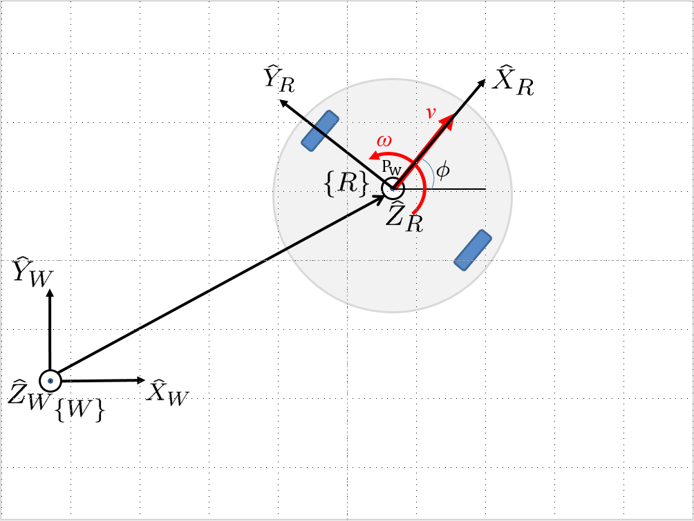

Lab 2: Open Loop Control
========================

Overview
--------

In this lab, we are going to learn how to write a Python script to control the robot.
You will be exposed to basic ROS concepts, including ROS Node, ROS Topic and ROS Publisher.
Tutorials and supplementary reading materials will be provided.

Specifically, the task is to make the robot move in a square shape using open-loop control 
(i.e. sending commands only; no feedback). 
The waypoints to visit are [4, 0], [4, 4], [0, 4] and [0, 0]. 
In other words, the robot should move forward 4 meters, turn left 90 degrees, 
move forward again 4 meters, and so on, until going back to the origin. 
Note that the robot is supposed to stop at the origin after completing this square movement,
and the Python script should exit gracefully. 

Preview: Next week we will learn how to use closed-loop control to track a trajectory.

Submission
----------

#. Submission: individual submission via Gradescope

#. Demo: required during the lab session (will use autograder; see below)

#. Due time: 5:00pm, Oct 14, Friday

#. Files to submit: (please use exactly the same filename; case sensitive)

   - lab2_report.pdf
   - open_loop.py

#. Grading rubric:

   + \+ 50%  Clearly describe your approach and explain your code in the lab report.
   + \+ 40%  The robot can visit all four vertices of the square trajectory (error < 1.0m). 
     Partial credits will be given according to the number of vertices visited.
   + \+ 10%  The script can complete the task on time and exit gracefully.
   + \- 15%  Penalty applies for each late day. 

Autograder
----------

All code submissions will be graded automatically by an autograder uploaded to Gradescope.
Your scripts will be tested on a Ubuntu cloud server using a similar ROS + Gazebo environment.
The grading results will be available in a couple of minutes after submission.

The autograder works in the following way (no action on your side needed; just to explain). 
(1) Under Gazebo simulation environment, the submitted Python script will be run for once 
and the robot trajectory will be saved into csv files. 
(2) The scores will be given by evaluating the saved trajectory and uploaded back to Gradescope.

Testing parameters are as follows. 

#. The tolerance for distance error is set to 1.0m (considering this is open-loop control).

   - For example, passing point [3.6, 3.4] is approximately equivalent to passing point [4.0, 4.0].

#. The time limit for the submitted script is set to 5 mins.

   - If running properly, the task in this lab can be done in about 1 min, based on our testing.
   - If running timeout, the script will be terminated and a 10% penalty will apply.
   - Therefore, it is important that your script can exit gracefully after task completion.
     (Just avoid using infinite loops and/or remember to add a break condition.)

#. The global time limit on Gradescope server is set to 10 mins. 

   - If running timeout, the entire grading process will be terminated and you will have no grading results. 
   - This can happen if you have dead loop in the script (e.g., ``while True: xxx``)
     and the autograder is not able to terminate the script. 
     (Scripts like this cannot be terminated by ``Ctrl + C`` in terminals, if you test it yourself.)

Introduction to Turtlebot
-------------------------

The Turtlebot 2 robot is a differential wheeled robot built on top of the Kobuki mobile base. 
We have customized it to include more sensors (one Lidar, two cameras, and one manipulator).
See the image (left) below for Turtlebot family. 

Though multiple layers of plates/sensors are placed on top of the robot, 
the kinematics of the robot can be simplified according to the property 
of its mobile base, which uses differential drive for locomotion.
The differential mobile base has two powered wheels, located symmetrically about its center. 

As users, we can send high-level commands (linear velocity ``v`` and angular velocity ``ω``) 
to the robot. The mobile base will first transform the ``v`` and ``w`` commands with respect to the 
robot center into the desired rotational speed of each wheel, and then control the rotational
speed by a feedback control of the current of the motor that drives the wheel. 

.. image:: pics/turtlebot_family.png
  :width: 53%

To describe the position and orientation of the robot, 
we attach a robot coordinate frame :math:`R` to it. 
The origin of this coordinate frame is centered between its powered wheels. 
The X axis of this frame is pointing forward (along the direction of the linear velocity ``v``),
the Y axis is pointing to the left, and the Z axis is pointing up.

To track the position and orientation of the robot, we generally define a world 
reference frame :math:`W`, in the same plane where the robot moves. 
With this frame assignment, the robot’s position is constrained to the X − Y plane of frame :math:`W`. 
Moreover, any rotation between the robot and the world frames can be expressed 
as a rotation about Z axis. 
Therefore, the position of the robot with respect to the world reference frame will have the form:

.. math::

  P_W = 
  \begin{bmatrix}
  x    \\
  y    \\
  0     
  \end{bmatrix}

while the rotation matrix expressing the orientation of the robot frame 
with respect to :math:`W` will be of the from:

.. math::

  R_{WR} = 
  \begin{bmatrix}
  cos(\phi) & -sin(\phi) & 0  \\
  sin(\phi) & cos(\phi) & 0   \\
  0 & 0 & 1     
  \end{bmatrix}

Programming Tips
----------------

#. We follow ROS conventions to use `SI units <https://en.wikipedia.org/wiki/International_System_of_Units>`_.
   (i.e. length in meter, time in second, angle in radian). 
   See ROS Wiki article `REP 103 Standard Units of Measure and Coordinate Conventions 
   <https://www.ros.org/reps/rep-0103.html>`_ for more information. 

#. When a new robot is spawned, the forward heading direction is the positive x axis; 
   the leftward direction is the positive y axis; and by right-hand rule, z axis upward. 
   This is also specified in `REP 103 <https://www.ros.org/reps/rep-0103.html>`_. 

#. Python is an indent-sensitive programming language, as opposed to C/C++.

   - You can use either ``space`` or ``Tab`` for indent, but please do not mix them in one file.
     Otherwise you will see lingering syntax errors. (IMO, ``space`` is recommended.)
   - A better way to organize indent is to use an Integrated Development Environment (IDE) for programming,
     where ``Tab`` key can be automatically converted into 2 or 4 ``space``s.

#. The recommended IDE in Linux is `VS Code <https://code.visualstudio.com>`_.
   Just go to the official website, download ``.deb`` file and install it. 

   - After installation, you can go to Extensions and search for ROS. 
     Adding this extension can help you highlight the code and bring more convenience. 

#. In Gazebo, you can use ``Ctrl + R`` to set the robot back to the origin without the need to relaunch.

#. In this lab, you need to finely tune the parameters for open-loop control. 
   
   - Please note that parameters may vary from platform to platform. In other words,
     the parameters work in your VM may not necessarily work in the cloud server running autograder.
   - In Gazebo, you can take the visualization as feedback (the grid size of the ground is 1 meter) 
     to tune the parameters. 
   - On Gradescope autograder, you can take the evaluation results (visited waypoints) as feedback 
     to make minor adjustments to the parameters you have already tuned in the VM.

Sample Code
-----------

A sample code is provided to make the robot move forward for a certain distance.
Please read carefully the provided code, and understand its functionality.
You need to make changes under ``run`` function to complete the square trajectory.
(Hint: honestly, this lab can be done in 10 lines of code if you know what you are doing.)

- Open a new terminal and go to your ``ee144f22`` package. 
  We will start from a new Python script.

  .. code-block:: bash

    roscd ee144f22
    mkdir scripts
    cd scripts
    touch open_loop.py
    gedit open_loop.py

- Please copy and paste the following code, then save and close it.

  .. literalinclude:: ../scripts/open_loop.py
    :language: python

.. note::

  Recall in Lab 1 that you need to first launch your Turtlebot robot in Gazebo on a terminal
  before sending any commands to it.
  .. code-block:: bash

    roslaunch ee144f22 gazebo.launch

- Back to the terminal, you can run it in two ways. 
  One is to feed this script as input to the Python program in Linux,
  as shown below.
    
  .. code-block:: bash

    python open_loop.py

- The other way is to run it as a regular executable in Linux. In this case,
  you need to first grant the execution permission to this Python script.
  This step only needs to be run once.

  .. code-block:: bash

    chmod +x open_loop.py

- Now you can see that this file is in green color when you ``ls`` the current directory in the terminal.
  This is how Linux terminal distinguishes executable (in green or highlight) and non-executable (in white).

  .. code-block:: bash

    ls

- Then you can run it by command

  .. code-block:: bash

    ./open_loop.py

.. note::

  Recall in Lab 1 that you need to first launch your Turtlebot robot in Gazebo
  before sending any commands to it.

  .. code-block:: bash

    roslaunch ee144f21 gazebo.launch

Sample Code Explained
---------------------

- Now, let's break the code down.

- The first line makes sure your script is executed as a Python script in Linux.
  You need this line if you want to run it as a regular executable (i.e. run by ``./filename.py``) in Linux.
  
  .. code-block:: python

    #!/usr/bin/env python

- You need to import rospy in order to use ROS in Python.
  This is the Python library that contains common operations and resources in ROS.

  .. code-block:: python

    import rospy

- This line imports a ``Twist`` *class* that can carry linear and angular velocity information. 
  Later on we will need to create an *instance* of this class, 
  assign the velocity value, and publish it out to the robot.

  .. code-block:: python

    from geometry_msgs.msg import Twist

- We import a high-precision value of pi (in radian) from math library. Print it out and see its value :)
  This is for your convenience to add the turning part of the code.

  .. code-block:: python

    from math import pi

- We use *class* to better organize resources (variables and functions) in Python scripts.
  With *class*, we can easily update the value of a variable in one function and have access to it
  from another member function. 

- In the following code structure, we first define a *class* named ``Turtlebot``, and then create
  an *instance* (*object*) called ``whatever`` in the Python main function.
  The Python program will start running from the line right after ``if __name__ == '__main__':``.
  However, to create a new instance, the program needs to run ``__init__`` function for once 
  (this is a function that every *class* must have for the initialization process).
  We then call ``run`` function under ``__init__`` function. 
  As such, each component is connected into the running pipeline. 
  
- The keyword ``self`` is a pointer used internally to refer to resources, and the keyword
  ``pass`` is just a placeholder that actually does nothing.

  .. code-block:: python
    
    class Turtlebot():
        def __init__(self):
            self.run()

        def run(self):
            pass

    if __name__ == '__main__':
        whatever = Turtlebot()

- The ``try-except`` block is used to handle exceptions. In this case, it will provide logging information
  when the user terminates the program using ``Ctrl + C``. 
  For the time being, we do not need to know more details on this.
  
  .. code-block:: python
    
    if __name__ == '__main__':
        try:
            whatever = Turtlebot()
        except rospy.ROSInterruptException:
            rospy.loginfo("Action terminated.")

- In ROS, we have a ROS Master (or ``roscore``) running as a central server to manage global resources
  and connect all ROS Nodes.
  Each program will need to talk to this central server first before talking to other program 
  (this process is, in other words, to register itself as a ROS Node). Therefore,
  in each and every Python script running ROS, the first thing to do is to initialize itself as a ROS Node. 
  The argument ``turtlebot_move`` is the name we would like to assign to this ROS Node. 

  .. code-block:: python

    rospy.init_node("turtlebot_move")

- What follows is a common logging function used in ROS. In addition to printing the message
  to screen (as what ``print`` function does in Python), it can also save the log in ROS 
  central server for further debugging purpose.

  .. code-block:: python

    rospy.loginfo("Press Ctrl + C to terminate")

- ROS Topic is a way that ROS Node communicates with each other for continuous data transmission. 
  (In this case, we keep sending velocity commands.)
  For one-time short communication, we also have ROS Service, which will not be covered in this course.
  
- On the robot side, there is a ROS Subscriber waiting for velocity commands.
  What we need to do in this script is to create a ROS Publisher to send commands.
  The required arguments are the topic name ``cmd_vel_mux/input/navi``, 
  the message type ``Twist``, and the queue size ``10``.

  .. code-block:: python

    self.vel_pub = rospy.Publisher("cmd_vel_mux/input/navi", Twist, queue_size=10)

- The following question is how frequently we should send velocity commands.
  Note that the robot will stop if no velocity command is received after a while,
  and the robot may "panic" if thousands of commands are received in a second.
  Therefore, we can pick a moderate rate at 10Hz (i.e. 10 commands per second).

- We use the ``Rate`` class to help us manage the timing. 
  By using the ``rate.sleep()`` function together with ``while`` or ``for`` loop,
  we can approximately keep the loop running at 10Hz rate. 
  The ``rate.sleep()`` function can calculate how much time elapsed **since last time 
  it was called**. If this time elapsed is less than 1/rate (in this case 0.1s),
  it will block the program till the time has reached 1/rate. 
  If the time has already exceeded 1/rate, it will simply let it go. 

  .. code-block:: python

    self.rate = rospy.Rate(10)
    for i in range(50):
        self.vel_pub.publish(vel)
        self.rate.sleep()

- To prepare a ROS Message that contains velocity data, 
  we first create an *instance* (called ``vel``) of the ``Twist`` class 
  (which is the message we are about to send), 
  and then assign linear and angular velocity to its corresponding variable.
  Note that you need to use ``.`` to have access to the member variables of a *class* data structure.
  See `ROS Wiki documentation <http://docs.ros.org/melodic/api/geometry_msgs/html/msg/Twist.html>`_ 
  for more information about the message definition. 

  .. code-block:: python

        vel = Twist()
        vel.linear.x = 0.5
        vel.angular.z = 0
        self.vel_pub.publish(vel)

- Lastly, if you use ``while`` loop, it is highly recommended to add a condition
  to check if the ROS server is still alive. 
  This can help terminate the Python script whenever you press ``Ctrl + C`` in the terminal. 
  On the contrary, dead loop like ``while True: xxx`` will not respond to your shutdown commands
  (unless you add proper ``break`` condition in the loop).
  
  .. code-block:: python

    while not rospy.is_shutdown():
        pass

Reading Materials
-----------------

ROS Nodes
~~~~~~~~~

- `Understanding ROS Nodes <http://wiki.ros.org/ROS/Tutorials/UnderstandingNodes>`_

- `Initialization and Shutdown <http://wiki.ros.org/rospy/Overview/Initialization%20and%20Shutdown>`_

ROS Topics and Messages
~~~~~~~~~~~~~~~~~~~~~~~

- `Messages <http://wiki.ros.org/Messages>`_

- `Understanding ROS Topics <http://wiki.ros.org/ROS/Tutorials/UnderstandingTopics>`_

- `Publishers and Subscribers <http://wiki.ros.org/rospy/Overview/Publishers%20and%20Subscribers>`_

ROS Conventions
~~~~~~~~~~~~~~~

- `REP 103 Standard Units of Measure and Coordinate Conventions 
  <https://www.ros.org/reps/rep-0103.html>`_

- `REP 105 Coordinate Frames for Mobile Platforms <https://www.ros.org/reps/rep-0105.html>`_

