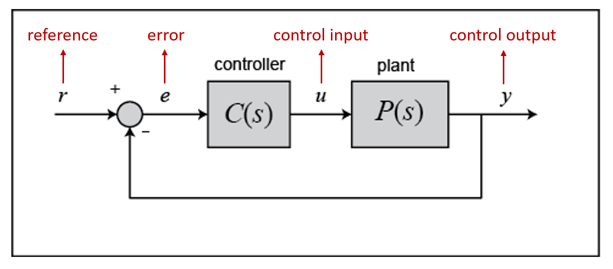

Lab 3: Closed Loop Control
==========================

Overview
--------

In this lab, we are going to apply closed-loop control to trajectory tracking. 
A ROS Subscriber is included in the script to receive real-time odometry feedback from Gazebo simulator.
With the odom/pose updates, the robot can adjust its moving direction accordingly and check if 
the desired waypoint has been reached.

Specifically, the task is to implement a PD controller (a variant/subset of PID controller)
to track the square shape trajectory. 
Same as in Lab 2, the waypoints are [4, 0], [4, 4], [0, 4], [0, 0], and the sequence does matter.
After task completion, the robot should stop at the origin and the Python script should exit gracefully. 
Please plot the trajectory (using another provided Python script) and discuss your results in the lab report. 

Preview: We will play with manipulators in Gazebo next time. 
(Specifically, to solve a Forward Kinematics problem.)

Submission
----------

#. Submission: individual submission via Gradescope

#. Demo: not required

#. Due time: 11:59pm, Oct 24, Saturday (in one week)

#. Files to submit: (please use exactly the same filename; case sensitive)

   - lab3_report.pdf
   - closed_loop.py

#. Grading rubric:

   + \+ 30%  Clearly describe your approach and explain your code in the lab report.
   + \+ 20%  Plot the trajectory and discuss the results of different values of ``Kp`` and ``Kd``.
   + \+ 40%  Implement PD controller; visit four vertices of the square trajectory with error < 0.1m. 
     Partial credits will be given according to the number of vertices visited.
   + \+ 10%  The script can complete the task on time and exit gracefully.
   + \- 15%  Penalty applies for each late day. 

Autograder
----------

All code submissions will be graded automatically by an autograder uploaded to Gradescope.
Your scripts will be tested on a Ubuntu cloud server using a similar ROS + Gazebo environment.
The grading results will be available in a couple of minutes after submission.

Testing parameters are as follows. 

#. The tolerance for distance error is set to 0.1m (considering that this is closed-loop control).

   - For example, passing point [3.96, 3.94] is approximately equivalent to passing point [4, 4].

#. The required waypoints for square trajectory are [4, 0], [4, 4], [0, 4] and [0, 0]; sequence matters.

#. The time limit for the submitted script is set to 5 mins.

   - If running properly, the task in this lab can be done in about 2 mins, based on my testing.
   - If running timeout, the script will be terminated and a 10% penalty will apply.

.. note::

  It is required to use closed-loop control (i.e. PD controller) to track the trajectory. 
  Finely tuned open-loop control script may also pass the autograder tests, but is not allowed.
  All scripts will be double checked when grading manually. 
  Penalty will apply if such script is found.

PID Control
-----------

Consider the following feedback control diagram. 

- The plant is the system we would like to control. 
  In our case, the control input ``u`` is the velocity command we send to the robot,
  and the control output ``y`` is the current state (2D pose: x, y, theta) of the robot.

- The controller is what we need to design. 
  It takes the tracking error ``e``, which is the difference between the desired output ``r`` 
  and the actual output ``y``,
  and computes the control input ``u`` according to the following equation. 
  (The control input to the plant is the output of the controller.)

.. math::
  
  \begin{equation*}
  u(t)=K_{p} e(t)+K_{i} \int e(t) d t+K_{d} \frac{d e}{d t}
  \end{equation*}

- For discrete systems, we can replace integral with summation and replace derivative with subtraction. 
  In programming, for integral term, one more variable is needed to sum up all history value;
  for derivative term, one more variable is needed to track the value at the last moment.
  
- ``Kp``, ``Ki``, and ``Kd`` are the coefficients/parameters we need to tune. 
  You may start with value 1; tune the parameters and see what happens.

- In math, it has rigorous analysis to show the stability and convergence of the system,
  which can be used to calculate the optimal parameters ``Kp``, ``Ki`` and ``Kd``. 
  (This should be covered in EE132 Automatic Control class, which is the prerequisite of this class.)
  See this 
  `PID Controller Design <http://ctms.engin.umich.edu/CTMS/index.php?example=Introduction&section=ControlPID>`_ 
  tutorial for more information. 

Due to the negative effect from integral component, we drop this term in the controller design.
In this lab, we will only focus on PD controller. 

A discrete PD controller implementation in Python is provided (partially though) for your information. 
You may or may not use it in your own implementation.
To make it work, you need to understand the PD control algorithm 
and fill in the ``update`` function.

  .. literalinclude:: ../scripts/controller.py
    :language: python

Programming Tips
----------------

- In general, PID controller is applied to track a certain target value (called setpoint),
  and make sure the system can converge to this target value. 
  For example, to control the temperature in a boiler system. 
  (Note that this is a scalar, set to a certain value.)
  
- In our case, we have three variables (x, y, theta) to describe the 2D pose of the robot.
  Only one of them can be set as the desired value to track in a PID controller. 
  In other words, a set of PID parameters (Kp, Ki and Kd) is needed for each variable.
  You can track either one variable (theta recommended) or multiple variables in your implementation.

- We recommend adding an upper bound checking for the control input (both linear and angular velocity)
  computed by the controller, before sending to the robot.
  This can make the movement smooth and physically feasible. 
  (e.g., the robot will go crazy or get damaged if a 10m/s linear velocity is given.)

- One important question to ask in this lab is: How to express the orientation in 2D plane? 
  You may think of [-pi, pi] or [0, 2pi]. Both correct. 
  However, the key is to properly handle the abrupt change of the angle when the robot passes the boundary. 
  This is one of the challenges you need to figure out. 
  If you don't take good care of the angle representation, 
  you can reach the first two waypoints of the square, but not the third one. 

The following is an example of the feedback control algorithm and its application to waypoint navigation problem.

#. Suppose the robot’s current orientation is :math:`\phi`, the desired orientation is :math:`\phi^*`,
   the current position on X-Y plane is :math:`(x, y)`, and the desired position on X-Y plane is :math:`(x^*, y^*)`. 
#. Calculate the moving direction from the difference between :math:`(x, y)` and :math:`(x^*, y^*)`;
   set it as the desired orientation :math:`\phi^*`. 
#. Initialize a PID controller with the setpoint :math:`\phi^*` and a set of parameters.
   Adjust the angle according to the angular velocity computed by the PID controller. 
#. Once :math:`\phi \rightarrow \phi^*`, start moving forward at a constant speed, and checking 
   the remaining distance toward desired position :math:`(x^*, y^*)`.
#. Once :math:`(x, y) \rightarrow (x^*, y^*)`, stop, turn in place, and move toward the next waypoint. 

Sample Code
-----------

A sample code is provided as the starting point for your implementation. 
Please read carefully the provided code, and understand its functionality. 

- Open a new terminal and go to the ``ee144f20`` package. 
  We will start from a new python script.

  .. code-block:: bash

    roscd ee144f20/scripts
    touch closed_loop.py
    gedit closed_loop.py

- Please copy and paste the following code, then save and close it.

  .. literalinclude:: ../scripts/closed_loop.py
    :language: python

- Please make changes to the ``run`` function to complete the task in this lab.
  Once finished, you can run it two ways as introduced in Lab 2.
  (Remember to bring up the robot before running the script.)

  .. code-block:: bash

    python closed_loop.py

  .. code-block:: bash

    chmod +x closed_loop.py
    ./closed_loop.py

Sample Code Explained
---------------------

- Odometry works in the way that it counts how many rounds the wheel rotates. 
  Therefore, if you lift and place a robot from one place to another, it will still "think" 
  that it is at the original place.

- In Gazebo simulator, using command ``Ctrl + R`` to reset the robot is similar to 
  lifting the robot and placing it to the origin, where the odometry will still report 
  the previous history record. Therefore, to obtain a correct odometry feedback for the 
  new run, we need to reset the odometry to zero. 

  .. code-block:: python

    self.reset_pub = rospy.Publisher("mobile_base/commands/reset_odometry", Empty, queue_size=10)
    for i in range(10):
        self.reset_pub.publish(Empty())
        self.rate.sleep()

- In Lab 2, we have learned how to use ROS Publisher to send a message out. 
  ROS Subscriber is the one on the other side to receive and process the messages.
  The required arguments are the topic name ``odom``, 
  the message type ``Odometry``, and a pointer to the callback function.
  The callback function will be executed whenever a new message is received (asynchronously; in another thread).
  We leverage the shared variables in Turtlebot class to store the latest pose of the robot.
  Note that the ``msg`` argument in the callback function is of the type ``Odometry``. 
  The definition is specified in 
  `the ROS Wiki documentation <http://docs.ros.org/en/melodic/api/nav_msgs/html/msg/Odometry.html>`_.

  .. code-block:: python

    self.odom_sub = rospy.Subscriber("odom", Odometry, self.odom_callback)

    def odom_callback(self, msg):
        pass

- In the ``try-except`` structure, ``finally`` is the keyword to indicate that the following
  code block will be executed regardless if the try block raises an error or not. 
  In this case, we want to save the trajectory even when the robot stops halfway.

  .. code-block:: python

    finally:
        # save trajectory into csv file
        np.savetxt('trajectory.csv', np.array(self.trajectory), fmt='%f', delimiter=',')

Visualization
-------------

We provide a separate Python script to help visualize the trajectory from the saved csv file. 
Please do not submit this file and do not include it in the script you plan to submit,
as it will block the autograder until running timeout.

.. literalinclude:: ../scripts/visualization.py
  :language: python

