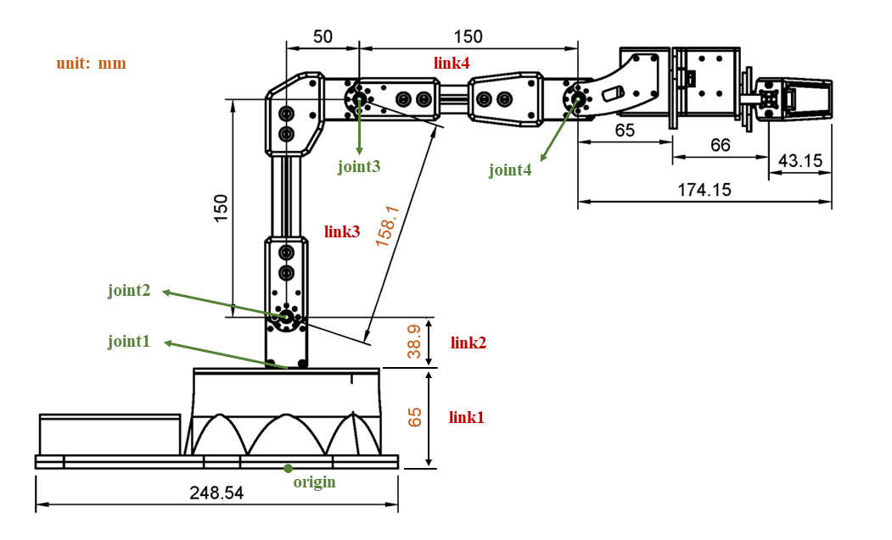
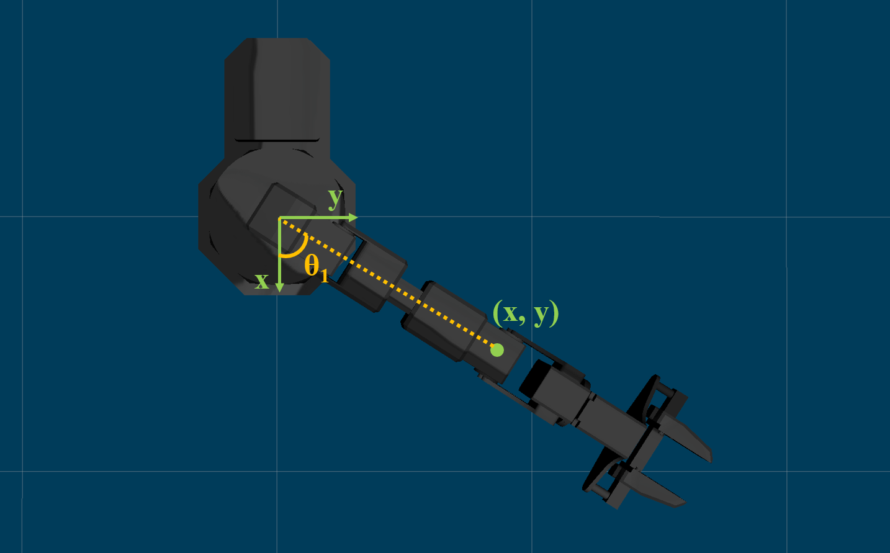
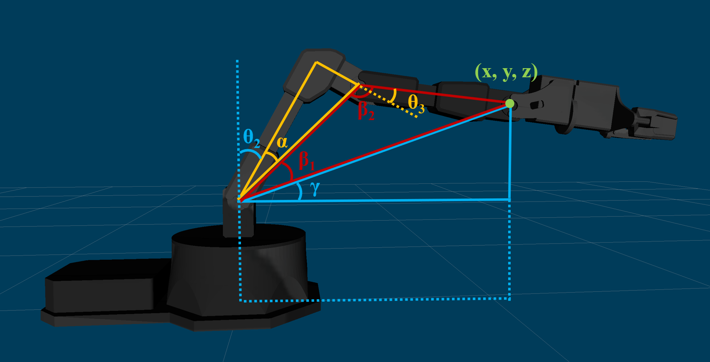

Lab 4: Forward and Inverse Kinematics
=======================================

Note
-----
In this lab (and all the following labs), we will team up! 
So you can work with your teammate on the lab assignments. 
While both of you should contribute and TA will ask questions 
during your demo to make sure you know what you did.

Overview
--------

In this lab, we will switch gears and work on the manipulator.
Two algorithms will be designed.

#. We will write a script to solve the Forward Kinematics problem.
   Given joint angles and the dimension of the manipulator, 
   the task is to compute the position of the end effector.
   You can use Product of Exponentials, D-H Parameters or other approaches you like. 

#. We will also try to solve the Inverse KInematics problem.
   The task is to solve for a set of feasible joint angles,
   given the position of the end effector. 
   You can use either the analytical approach (by trigonometry) or the numerical approach (by Newton's method). 

We will provide a couple of test cases for you on autograder. 
The script you submitted should be able to pass all test cases.

Preview: You will **team up**, test your script and play with the physical robot in **WCH 125** next time.

Submission
----------

#. Submission: group submission via Gradescope

#. Demo: Both of the teammates will be asked questions.

#. Due time: 23:59pm, Nov 10, Friday

#. Files to submit: (please submit exactly the same file)

   - lab4_report.pdf (under the assignment **Forward Kinematics** in Gradescope)
   - forward_kinematics.py (under the assignment **Forward Kinematics** in Gradescope)
   - inverse_kinematics.py (under the assignment **Inverse Kinematics** in Gradescope)

#. Grading rubric:

   + \+ 50%  Clearly describe your approach and explain your code in the lab report.
   + \+ 25%  Implement forward kinematics and pass test cases.
   + \+ 25%  Implement inverse kinematics and pass test cases.
   + \- 15%  Penalty applies for each late day. 

Autograder
----------

All code submissions will be graded automatically by an autograder uploaded to Gradescope.
Your scripts will be tested on a Ubuntu cloud server using a similar ROS environment.
The grading results will be available in a couple of minutes after submission.

Testing parameters are as follows. 

#. The tolerance for distance error is set to 0.002m (Manhattan distance on x, y, z axes). 

   - The autograder will take the maximum of the error in x, y, z axes respectively,
     and check if the maximum error is less than 0.002m. 
   - For example, if the computed position is [0.020, 0.013, 0.298], and the 
     ground truth is [0.021, 0.012, 0.297], it should pass the test.

#. For the forward kinematics test, three test cases are visible to you; two test cases are hidden. 
   The hidden ones are designed to test some "corner cases" and 
   to make sure there is no hard-coded computation in the submitted script.
   
#. The autograder works in the way that it sends joint angles to the manipulator and 
   reads the results after the manipulator actually moves according to these angles. 
   It will compare the ground truth position with the position after 
   moving according to the computed angles.

#. The time limit is not set in this lab, as the script should be able to get it done in seconds.

Programming Tips
----------------

#. We provide two scripts ``forward_kinematics.py`` and ``inverse_kinematics.py`` for you,
   you need to complete and submit both of them. 

#. To simplify computation, we will regard ``joint4`` as the end effector. 
   In other words, you need to return the position of ``joint4`` instead of the actual end effector.
   The specification of the manipulator is attached in the end of the webpage, 
   where you can find which one is ``joint4``.

#. Options for Forward Kinematics

   - Directly write down the transformation matrices between joints and links.
   - Product of Exponentials in space frame.
   - Product of Exponentials in body frame.
   - Formulate Denavit-Hartenberg parameters between each frame and multiply all transformation matrices.
   - You can either compute everything using program, or pre-compute some matrices by hand.
   
#. Options for Inverse Kinematics. Please see lecture slides for more information.

   - Analytical approach by trigonometry
   - Numerical approach by Newton's method

#. Two math tools that might be helpful for the analytical approach. 

   - Two-argument arctangent :math:`\theta = arctan(y, x) \in (-\pi, \pi]` (we use ``atan2`` in programming)
   - Law of cosines :math:`\gamma = arccos(\frac{a^2 + b^2 - c^2}{2ab}) \in (0, \pi)`

#. Math library and functions that might be helpful for the numerical approach.

   - ``import sympy as sym`` the math library ``sympy`` can help with symbolic mathematics
   - ``sym.cos`` and ``sym.sin`` the symbolic version operations (distinct from those in ``math`` library)
   - ``sym.symbols`` create symbolic variables
   - ``sym.diff`` compute the derivative of a function with respect to a variable
   - ``sym.lambdify`` transform a symbolic function in sympy into a native Python function 
     (using lambda expression), such that the Python function can be evaluated at given points later on.
   - If you do want to proceed with the numerical approach, you need to read the documentation of these functions
     in order to properly use them in programming. 

#. Please pay attention to the data type used in your computation.

   - If two matrices ``A`` and ``B`` are of the type ``np.array``, 
     then ``A * B`` will **not** perform matrix multiplication, but element-wise multiplication.

   - If two matrices ``A`` and ``B`` are of the type ``np.array``, 
     then ``np.dot(A, B)`` **will** perform matrix multiplication.

   - If two matrices ``A`` and ``B`` are of the type ``np.matrix``, 
     then ``A * B`` **will** perform matrix multiplication.

#. Functions available in ``numpy`` and ``modern_robotics`` library.

   - ``np.cross(A, B)`` the cross product of two vectors
   - ``np.concatenate([A, B])`` the concatenation of two vectors
   - ``mr.VecTose3(S)`` converts a 6x1 twist vector S to a 4x4 matrix in se(3) 
   - ``mr.MatrixExp6(M)`` the matrix exponential of a 4x4 matrix in se(3)

Sample Code
-----------

- Open a new terminal and go to your ``ee144f23`` package. 
  We will start from a new python script.

  .. code-block:: bash

    roscd ee144f22/scripts
    touch forward_kinematics.py
    gedit forward_kinematics.py

- Please copy and paste the following code, 
  and complete the ``forward_kinematics`` function in this file.

  .. literalinclude:: ../scripts/forward_kinematics.py
    :language: python

- Similarly, open a new terminal and go to your ``ee144f23`` package. 

  .. code-block:: bash

    roscd ee144f22/scripts
    touch inverse_kinematics.py
    gedit inverse_kinematics.py

- Please copy and paste the following code, 
  and complete the ``inverse_kinematics`` function in this file.

  .. literalinclude:: ../scripts/inverse_kinematics.py
    :language: python

Specification
-------------
The joint 1 could only rotate in the horizontal plane and joint 2, 3 could only rotate in the vertical plane.  

The dimension of the ReactorX 150 manipulator is the following.
We take ``joint4`` as the end effector point (instead of the actual gripper). 

Two more annotated figures to help you understand the trigonometry. 
The :math:`\theta_1`, :math:`\theta_2` and :math:`\theta_3` marked in the figures
are the joint angles you need to compute.

