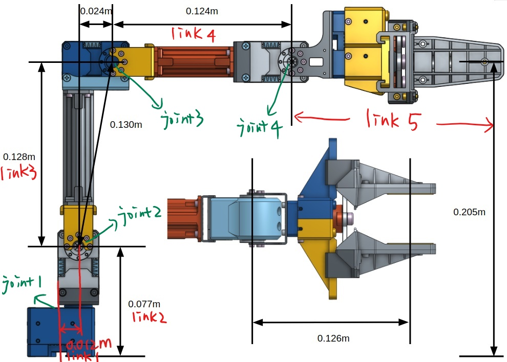

Lab 4: Open Manipulator
=======================

Overview
--------

In this lab, we will switch gears and work on manipulators. 
This lab aims to provide you some experience of working on manipulators,
and help you better understand forward kinematics and inverse kinematics.
With the help of the dimension of the manipulator, you need to figure out 
how to calculate the position of the end effector given joint angles (forward kinematics), 
and how to get a solution of joint angles given the position of the end effector (inverse kinematics).
Please refer to your lecture slides for more information about detailed approaches.

Submission
----------

#. Submission type: individual submission via iLearn

#. Demo: not required

#. Due time: at the beginning of next lab session

#. Files to submit: **(please do not zip, just upload all files)**

   - lab4_report_firstname.pdf (please use template and attach python code in the end)
   - open_manipulator.py
  
#. Grading rubric:

   + \+ 50%  Clearly describe your approach and explain your code in lab report.
   + \+ 30%  Implement forward kinematics and pass the test case.
   + \+ 20%  Implement inverse kinematics and pass the test case.
   + \+ 10%  Bonus points will be given if your algorithm can handle special cases (unreachable, multiple solutions).
   + \- 15%  Penalty applies for each late day. 

Preview: We will work on real robots in teams next time.

Setup
-----

According to `the official wiki website 
<http://emanual.robotis.com/docs/en/platform/openmanipulator_x/overview/>`_, 
we need to install the following packages and dependencies.

- Install dependencies from apt-get.

  .. code-block:: bash

    sudo apt-get update
    sudo apt-get install ros-kinetic-ros-controllers ros-kinetic-gazebo-* 
    sudo apt-get install ros-kinetic-moveit* ros-kinetic-industrial-core

- Install ROS packages from official GitHub repositories.

  .. code-block:: bash

    cd ~/catkin_ws/src/
    git clone https://github.com/ROBOTIS-GIT/DynamixelSDK.git
    git clone https://github.com/ROBOTIS-GIT/dynamixel-workbench.git
    git clone https://github.com/ROBOTIS-GIT/dynamixel-workbench-msgs.git
    git clone https://github.com/ROBOTIS-GIT/open_manipulator.git
    git clone https://github.com/ROBOTIS-GIT/open_manipulator_msgs.git
    git clone https://github.com/ROBOTIS-GIT/open_manipulator_simulations.git
    git clone https://github.com/ROBOTIS-GIT/robotis_manipulator.git
    cd ~/catkin_ws && catkin_make

- Load OpenManipulator-X on Gazebo simulator and **click on Play ▶ button**.

  .. code-block:: bash

    roslaunch open_manipulator_gazebo open_manipulator_gazebo.launch

- Open two new terminals and play with it by keyboard teleoperation.

  .. code-block:: bash

    roslaunch open_manipulator_controller open_manipulator_controller.launch use_platform:=false

    roslaunch open_manipulator_teleop open_manipulator_teleop_keyboard.launch

- Once you are familiar with this manipulator, close all terminals and go to the following steps.

Starter Code
------------

A starter code is given as the starting point for your implementation. 
Please read carefully the provided code, and understand its functionality. 

- Open a new terminal and go to your ``ee144f20`` package. 
  We will start from a new python script.

  .. code-block:: bash

    roscd ee144f20/scripts
    touch open_manipulator.py
    gedit open_manipulator.py

- Please copy and paste the following code, then save and close it.

  .. literalinclude:: ../scripts/open_manipulator.py
    :language: python

- Please add your code in ``self.forward_kinematics`` and ``self.inverse_kinematics`` functions
  to complete the script.

- As mentioned in Lab 2, you can run it two ways. 

  .. code-block:: bash

    python open_manipulator.py

  .. code-block:: bash

    chmod +x open_manipulator.py
    ./open_manipulator.py

- You can see the pose of **link**, and angle of **joint** in Gazebo, 
  by selecting the object and check the property on the left sidebar.

- **Check your result:** If your scripts are correct, 
  given ``jointangle(pi/6, -pi/3, pi/6, pi/3)`` as the argument of your forward kinematics function, 
  you should be able to get ``position(0.0194, 0.0043, 0.2230)`` as the return value, 
  and given ``position(0.0194, 0.0043, 0.2230)`` as the argument of your inverse kinematics function,
  you should be able to get ``jointangle(pi/6, -pi/3, pi/6, pi/3)`` as the return value.  

- Have fun!

.. note::

  You need to launch manipulator in Gazebo before running your script. 
  (No need to launch controller.)

  .. code-block:: bash

    roslaunch open_manipulator_gazebo open_manipulator_gazebo.launch

  Remember to **click on Play ▶ button** to start simulation!

Specification
-------------

The dimension of the open manipulator is the following.
Note that when you select link5 (gripper) in Gazebo simulation, 
you will actually get the position of joint4, rather than the center of link5.
Therefore, you can take the point of joint4 as the end effector in your mathematical calculation.
Also, this means that theta4 will not be used in your forward and inverse kinematics scripts,
but only be used for visualization purpose.

