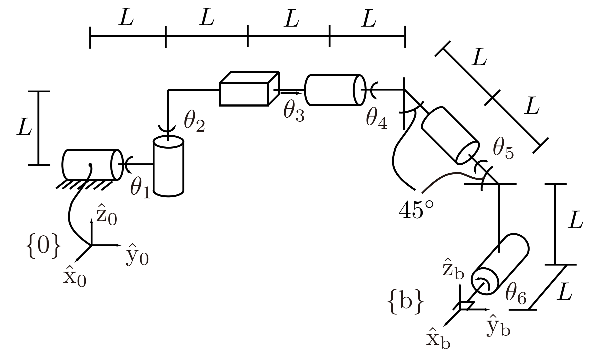

Lab 4 Bonus
===========

Overview
--------
This is a bonus programming assignment following the topic of Forward Kinematics in Lab 4.
The score of this assignment (a maximum of 20 bonus points) will be added in the midterm score. 
The problem is to derive and code the forward kinematics of the arm shown in Fig 4.18
in the textbook using the D-H formulation (10 points) and the PoE formula (10 points).  

Please follow the instructions as listed below.

- Please use exactly the same file name and function name for submission.

- Note that this time you need to return the final transformation matrix T, 
  as opposed to position only in Lab 4.

- There will be 20 test cases (10 for each approach) on autograder. 
  All scripts will be double checked and the final score may be manually adjusted. 

- It is required to use the PoE and the D-H parameters to solve the problem.
  In other words, PoE approach must be used in the ``forward_kinematics_poe.py`` script,
  and D-H approach must be used in the ``forward_kinematics_dh.py`` script.
  Otherwise penalty will apply and points will be deducted.

- Since this is a bonus, and to be fair with everyone, 
  there will be no late submission option available, 
  and we will not offer the kind of feedback we gave to Lab 4.

- No need to submit the lab report, as this is not a regular lab assignment. 

Submission
----------

#. Submission: individual submission via Gradescope

#. Due time: 11:59pm, Nov 9, Monday

#. Files to submit:

   - forward_kinematics_poe.py
   - forward_kinematics_dh.py

#. Grading rubric:

   + \+ 10 pts   Product of Exponentials
   + \+ 10 pts   D-H Parameters

Sample Code
-----------

- Two sample Python scripts are provided as follows. 

  .. literalinclude:: ../scripts/forward_kinematics_poe.py
    :language: python

  .. literalinclude:: ../scripts/forward_kinematics_dh.py
    :language: python

Specification
-------------

Figure 4.18 in the textbook is shown below. 

