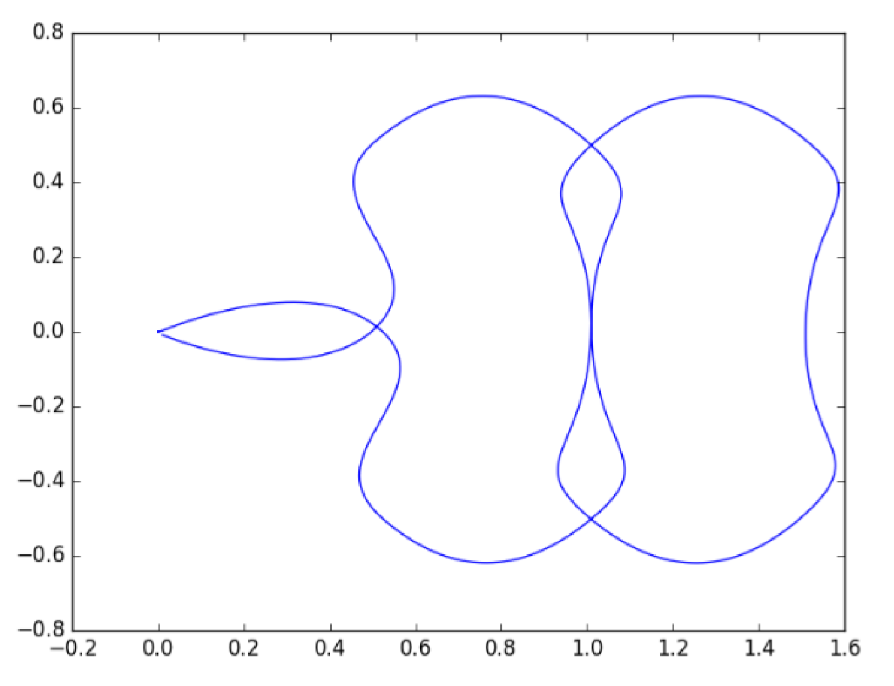

Lab 6: Trajectory Generation
============================

Overview
--------

In this lab, we will focus on how to generate **smooth trajectories** using polynomial time scaling. 

Specifically, the task is to implement the 3rd order polynomial time scaling and apply it
for each segment of the trajectory and for both x and y coordinates. 
Waypoints will be provided in the sample script, 
and should be included in the boundary/continuity constraints when generating trajectories.

Preview: Next time we will learn how to use A* algorithm to search for the waypoints, when a map is given.

Submission
----------

#. Submission: group submission via Gradescope

#. Demo: not required

#. Due time: 11:59pm, Nov 23, Monday

#. Files to submit:

   - lab6_report.pdf (please include the plot of trajectory)
   - trajectory_generation.py

#. Grading rubric:

   + \+ 30%  Clearly describe your approach and explain your code in the lab report.
   + \+ 20%  Plot the trajectory and discuss the results under different parameters.
   + \+ 50%  Pass all waypoints using 3rd order polynomial trajectories.
   + \- 15%  Penalty applies for each late day. 

Autograder
----------

All code submissions will be graded automatically by an autograder uploaded to Gradescope.
The scripts will be tested on a Ubuntu cloud server using a similar ROS + Gazebo environment.
The grading results will be available in a couple of minutes after submission.

Testing parameters are as follows. 

#. The tolerance for distance error is set to 0.1m.

   - For example, passing point [3.96, 3.94] is approximately equivalent to passing point [4, 4].

#. The autograder will check 8 out of 14 waypoints and the last stopping point [0, 0].

   - They are [0.5, 0], [0.5, -0.5], [0.5, 0.5], [1, 0], [1, -0.5], [1, 0.5], [1.5, -0.5], [1.5, 0.5]. 

#. The time limit is set to 5 mins.

Sample Code
-----------

- Open a new terminal and go to your ``ee144f20`` package. 
  We will start from a new python script.

  .. code-block:: bash

    roscd ee144f20/scripts
    touch trajectory_generation.py
    gedit trajectory_generation.py

- Please copy and paste the following code.

  .. literalinclude:: ../scripts/trajectory_generation.py
    :language: python

- This script is following the same structure as the one used in Lab 3, 
  except for the changes under ``run`` function.

- You need to complete the ``move_to_point`` function in this code,
  and make sure the robot can pass all the waypoints. 
  The ``polynomial_time_scaling_3rd_order``
  function is provided for your information only. You may or may not use it.

Polynomial Time Scaling
-----------------------

Suppose that we have figured out a path from point A to point B. 
The question is how fast the robot should follow the path (i.e. where it should be at each moment). 
This process of generating intermediate points (each associated with a time stamp) is called 
time scaling, or trajectory generation at large. 

Recall that sending constant velocity commands from the very beginning would assume
the robot can have infinite large acceleration at the first moment, which is impractical.
Therefore, we would like to have a smooth trajectory that can best fit robot kinematics. 

On the other hand, polynomial functions are smooth (infinitely differentiable) functions that can provide us
smooth trajectories at all orders (position, velocity, acceleration, the derivative of acceleration, and so on).
To this end, polynomial time scaling becomes a good choice to generate trajectories. 

Suppose that we plan to move from point A to point B in ``T`` seconds by following a straight line.
Then where the robot should be at each moment can be described by the following function.
It provides the position of the robot ``x(t)`` at any given time ``t``.

.. math::

  \begin{equation}
  x(t) = a_{0} + a_{1} t + a_{2} t^{2} + a_{3} t^{3}, t \in [0, T]
  \end{equation}

Accordingly, the expected velocity at any time ``t`` can be described 
by the derivative of this polynomial function.

.. math::

  \begin{equation}
  \dot{x}(t) = a_{1} + 2 a_{2} + 3 a_{3} t^{2}, t \in [0, T]
  \end{equation}

The key is to figure out the coefficients of this function **for each and every trajectory segment**
and **for both x and y coordinates**. 
In other words, coefficients can vary from segment to segment, 
as each segment should adopt different initial and terminal conditions to best fit its needs.

Fortunately, we can formulate this problem into a linear system of equation as follows,
where :math:`x_0, x_T, \dot{x}_0, \dot{x}_T` are initial/terminal position/velocity respectively. 
  
.. math::

  \begin{equation}
  \left[\begin{array}{c}
  x_{0} \\
  x_{T} \\
  \dot{x}_{0} \\
  \dot{x}_{T}
  \end{array}\right]=\left[\begin{array}{cccc}
  0 & 0 & 0 & 1 \\
  T^{3} & T^{2} & T & 1 \\
  0 & 0 & 1 & 0 \\
  3 T^{2} & 2 T & 1 & 0
  \end{array}\right]\left[\begin{array}{l}
  a_{3} \\
  a_{2} \\
  a_{1} \\
  a_{0}
  \end{array}\right]
  \end{equation}

To solve this equation of the form :math:`x = Ta`, we can simply take the advantage of the inverse matrix
and have the solution :math:`a = T^{-1}x`.

So far we have introduced the basic steps to solve for a polynomial time scaling problem.
The following are three final remarks regarding the selection of parameters.

#. Two ways to pick the time interval ``T``
   (this is one of the drawbacks of this approach; you have to specify ``T`` ahead of time)

   - Fixed time interval for all segments.

   - Pick a preferred average speed, then determine ``T`` based on the distance to travel.

#. Notes on boundary conditions and continuity constraints
   
   - It is better to look at not only the current waypoint, but also the next one.
     Because normally the next waypoint can provide useful information to 
     help determine how to pass the current waypoint. 
     
   - For example, when moving from point A to point B by following a straight line, 
     knowing that point C is to the right of point B is a good indicator to curve the 
     current trajectory a bit more, such that this turning behavior can be evenly distributed 
     in the trajectory and avoid a sharp turn at point B.

   - In practice, the magnitude of the velocity can be set to a preferred speed, and
     the direction of the velocity of passing point B can be set to the direction from point A to point C.

#. Discussion on the numerical stability of polynomial functions

   - It is possible to use a continuous timeline for all trajectories 
     (i.e. :math:`[0, T]` for the first segment, :math:`[T_1, T_2]` for the second, and so on).
     However, this approach is not numerically stable, especially when the order of the polynomial is higher.

   - For example, in a 7th order polynomial function, as :math:`T` grows larger, 
     to make the term :math:`a_7 t^7` reasonably small, 
     the parameter :math:`a_7`  will have to be at the level of :math:`10^{-10}` or even smaller. 
     
   - Conclusion: we recommend using relative time scale :math:`[0, T]` for all segments (i.e. reset timing every time).

Visualization
-------------

- You can reuse the visualization python script provided in Lab 3 to plot the trajectory.
  Remember to adjust the limit on x and y axes and include it in the lab report. 

- An example of the trajectory is provided as follows.
  It is a bit overshooting. You can do better :)

