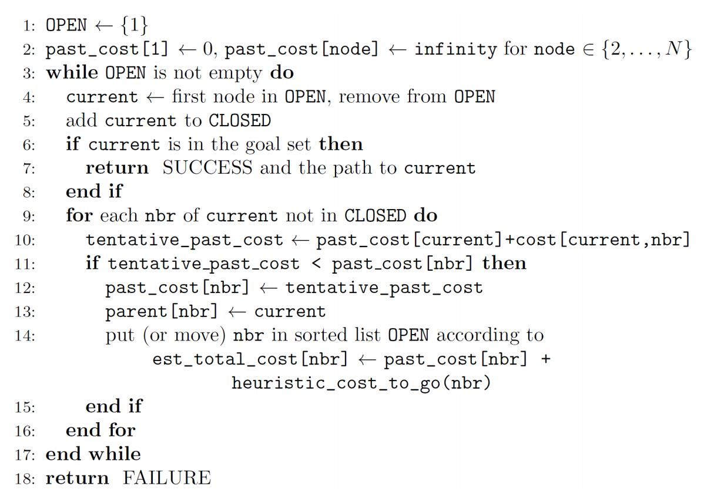

Lab 7: Motion Planning
======================

Overview
--------

In Lab 6, we can generate trajectories when waypoints are given. 
In this lab, we will implement A* algorithm to search for these waypoints.

We assume a grid map is given with some grids marked as obstacles.
The task is to apply A* algorithm to find an optimal path from the start grid to the goal grid
without colliding with obstacles. 
You can use Manhattan distance or Euclidean distance as the heuristic function.
(Other admissible heuristic functions should also work.)
No diagonal movement is allowed (i.e. use 4-connected graphs). 

Please refer to the lecture slides for more details. 
The pseudocode is provided at the end of this page.

Preview: Next time we will learn how to generate the grid map from a real world environment 
and apply what we have learned so far on real robots.

Submission
----------

#. Submission: group submission via Gradescope

#. Demo: not required

#. Due time: 5:00pm, November 26, Friday

#. Files to submit:

   - lab7_report.pdf
   - motion_planning.py

#. Grading rubric:

   + \+ 50%  Clearly describe your approach and explain your code in the lab report.
   + \+ 50%  Implement A* algorithm and pass all test cases.
   + \- 15%  Penalty applies for each late day. 

Autograder
----------

For each A* path computed, the autograder will check the following conditions. 

#. The returned path should be a Python list, and each element in the list should be a 2-tuple.
   (Will discuss this data type soon.)

#. The path should not collide with any obstacle. 

#. The path should contain the goal grid but not the start grid.

   - For example, the path from (0, 0) to (2, 2) should be [(1, 0), (1, 1), (2, 1), (2, 2)]
   - This is a convention in grid-based motion planning, such that when iterating over the list,
     it can lead the robot to the goal.

#. The path should have 4-connectivity from the first element to the last. 

   - In other words, at each step, from one grid to the next, 
     the robot can move in only one of the four directions 
     [1, 0], [-1, 0], [0, 1] or [0, -1]. No diagonal movement is allowed.
   - The start grid and the first element in the path should also have 4-connectivity.

Sample Code
-----------

- Open a new terminal and go to your ``ee144f21`` package. 
  We will create a new python script.

  .. code-block:: bash

    roscd ee144f21/scripts
    touch motion_planning.py
    gedit motion_planning.py

- Please copy and paste the following code.

  .. literalinclude:: ../scripts/motion_planning.py
    :language: python

- To test the algorithm, you can use the following script and change test cases as you want. 

  .. literalinclude:: ../scripts/test_motion_planning.py
    :language: python

- An example of the grid map and the corresponding A* path is shown below.

  .. image:: pics/A_star_before.png
    :width: 48%
  .. image:: pics/A_star_after.png
    :width: 48%

A* Pseudocode
-------------

You may refer to the pseudocode shown below.

Programming Tips
----------------

#. Review of some use cases of Python List

   - ``path = list()`` or ``path = []`` creates an empty list.
   - ``path.append()`` appends a new element to the end of the list.
   - ``path.pop()`` removes (and returns) the element at the specified position.
   - ``path.sort()`` sorts the list ascending by default.
   - ``path.reverse()`` reverses the sorting order of the elements.

#. Tuple data type in Python

   - In Python, [0, 0] is a list with 2 elements, while (0, 0) is a tuple with 2 elements (named 2-tuple).
   - [[0, 1], [1, 1], [1, 2]] is a list and its elements are also lists,
     while [(0, 1), (1, 1), (1, 2)] is a list and its elements are tuples.
   - A path should be a list with multiple elements, and each element is a 2-tuple. 

#. Dictionary data type in Python

   - ``d = dict()`` or ``d = {}`` creates an empty dictionary. 
   - We have to use tuple in this lab because tuple is 
     `hashable <https://stackoverflow.com/questions/14535730/what-does-hashable-mean-in-python>`_,
     and hence can be used in a dictionary.
   - The operation ``d[start] = 0`` is invalid if ``start`` is a list 
     and valid if ``start`` is a tuple.

#. Comparison over List, Tuple and Dictionary

   - ``List`` is ordered and changeable. Allows duplicate members.
   - ``Tuple`` is ordered and unchangeable. Allows duplicate members.
   - ``Dictionary`` is unordered, changeable and indexed. No duplicate members.
