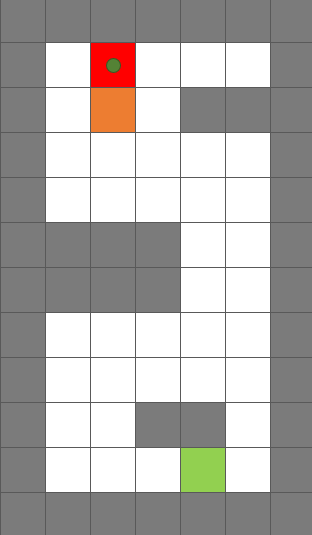

Lab 8: Go! Turtlebot!
=====================

Overview
--------

In this lab, we will put everything together and apply what we have learned so far 
on real robots. 
The task is to navigate in a real world environment without colliding with obstacles
and finally kick the ball (the gridmap that indicates start, goal points as well as the positions of obstacles will be given.). 
Basic steps are as follows. 

#. Run A* algorithm to search for an optimal path and return the list of waypoints.
#. Use the obtained waypoints to generate polynomial trajectories for the robot to follow. 

We will not provide starter code in this lab. 
Please reuse the scripts in Lab 6 and Lab 7 and combine them
into a single file named ``turtlebot.py`` for submission. 

**A successful demo on Gazebo is required before any 
implementation on the real robot.**

Submission
----------

#. No Submission Required

#. Demo: **required on Gazebo and the real robot**

#. Due time: lab session

#. Grading rubric:

   -  \+ 60%  Demo the task on Gazebo
   
      -  \+30% Obtain the correct waypoints (Please print your final path).
      -  \+30% Obtain an optimal trajectory based on the obstacles positons.
   -  \+ 40%  Demo the task on the real robot
   
      -  \+10% Communicate successfully with the real robot
      -  \+10% Navigate via the correct waypoints.
      -  \+10% Avoid collision with obstacles.
      -  \+5% Reach the goal area.
      -  \+5% Kick the ball.

Lab Rules
---------

#. Safety is always the top priority.

   - No food or beverage allowed in the lab.
   - Report any suspicious cables, wires, etc.

#. Organize your station before you leave.

   - **Cut off all power supply (both robot base and NUC)**.
   - Organize wires, cables, etc.

#. Do not leave your personal information on the robot.

   - Create your own folder when you work, and delete code when you leave.
   - The robot is shared by three lab sections.

#. Do NOT make any changes to the wiring on the robot.

#. Please save the battery (recharging takes time), 
   and charge the robot if you do not have it running.
  
Remote Login
------------

- Connect to ``UCR-SECURE`` WiFi network. 
  Please ask TAs for credentials.
  Check if your Internet connection is good.

- The IP address of your Ubuntu VM is dynamically allocated, 
  while the IP address of your robot (NUC computer) is static.

- Connect power bank to the NUC onboard computer on your robot, 
  then turn on the robot and NUC computer.

- To remote login to the NUC computer on your robot, 
  open a new terminal in your VM and run

  .. code-block:: bash

    ssh username@NUC_IP

- Replace the above ``username`` and ``NUC_IP`` with the actual one.
  For example, the IP address of robot 01 is ``10.40.2.21``, 
  and the IP address of robot 03 is ``10.40.2.23``, and so on.
  The username on NUC computer is ``ee144-nuc01`` for robot 01, and so on.

- For example, for robot 01 we can use

  .. code-block:: bash

    ssh ee144-nuc01@10.40.2.21

- Please ask TAs for the password of this account.

- You can see the new username and hostname on your terminal if you succeed.
  It should be like ``ee144-nuc01@ee144-nuc01``.

- If you want to use graphic tools later on, then use

  .. code-block:: bash

    ssh -X username@NUC_IP   (must be capitalized X)

- To disconnect, just run

  .. code-block:: bash

    exit

- To shutdown your remote computer, run

  .. code-block:: bash

    sudo shutdown now
    
Copy Files
----------

- Command ``scp`` (secure copy) can help you copy files between two computers.
  
- To copy files from your VM to robot, open a terminal in your VM and run

  .. code-block:: bash

    scp /path/to/file/name.py username@NUC_IP:/path/to/destination

- To copy files from robot to your VM, just switch the above two arguments

  .. code-block:: bash

    scp username@NUC_IP:/path/to/file/name.py /path/to/destination 
    
Communication with TurtleBot
----------------------------

- Once you have successfully login to the actual robot, 
  the following command can bring up the Kobuki mobile base. 

  .. code-block:: bash
    
    roslaunch turtlebot_bringup minimal.launch --screen

- Then you can open another terminal and remote login (again, twice) to the robot to run the script.

- Alternatively, you can use another terminal to run the teleop command for testing **using the default linear and angular velocity**. 

  .. code-block:: bash
    
    roslaunch turtlebot_teleop keyboard_teleop.launch

- To edit the script already copied to the robot, use the following command. 
  (This is where you may fail if ``-X`` option was not specified when using ssh.)

  .. code-block:: bash
    
    gedit ~/team01/turtlebot.py

- Then demo to TAs.

.. note::

  When you bring up the robot, the odometry will be reset (initialized to origin).

Field Map
---------

A grid map will be provided for the simulation on Gazebo and the implementation on the real robot based on the assigned space for each team. The figure shows an example of the structure of the grid map 
of the real world.

- **The grid size is 0.5m**, which is slightly larger than the size of the robot.

- The grey grids are obstacles and walls that the robot should not collide with.

- **The starting point is the origin (0,0) of the grid map.**
  and is represented by the green grid on the bottom right.
  During the demo, each team will have a different starting point. 
  (You will be informed which grid to start from before you run the script.)

- On the top side, the red grid is the goal area where the robot should stop, 
  and the orange grid is the buffer area where the robot should pass through, in order to kick the ball.

.. - On the top side, the narrow gate is marked by dark blue color,
  and the wide gate is marked by light blue color.

- The ball is placed in the middle of the red grid, marked by dark green color.

- To assess your code, we provide the start, goal and obstacles coordinates for the given grid map:

  .. code-block:: python

    start = (0, 0)
    goal = (9, 2)
    obstacles = [(1, 0), (1, 1), (4, 1), (4, 2), (4, 3), (5, 1), (5, 2), (5, 3),(8, 0), (8, -1)]

About the simulation 
---------------------

Before you implement your code in the real robot, you should firstly run it on Gazebo.
Please follow the steps:

#. Determine the start point, goal point and positions of obstacles.

   - Please test your algorithm using the example given in last section and demo to TAs.
   - During the lab, a different gridmap will be given to you. You need to determine its start, goal point and obstacles then.   

#. Combine your lab 6 and lab 7 code into a single file named ``turtlebot.py`` so it could achieve the following functions:

   - Input the start, goal point and obstacles to your lab 7 script to output the optimal trajectory.
   - Send the waypoints generated by the optimal trajectory to your lab 6 code to get the smooth polynomial trajectory.
   
#. Launch Gazebo and run your script ``turtlebot.py``

About the implementation
------------------------

- We divide the space into three parts to accommodate three teams at the same time.
  They are designed to have different layouts.
  
- Each team have unlimited trials during the allocated time slot for the final demo on the real robot.

- For each trial, the robot will start from the starting grid, plan and follow its smooth trajectory, kick the ball, and stop at the goal area.

- The robot should have a reasonable velocity in order to kick the ball and not collides with the wall.
