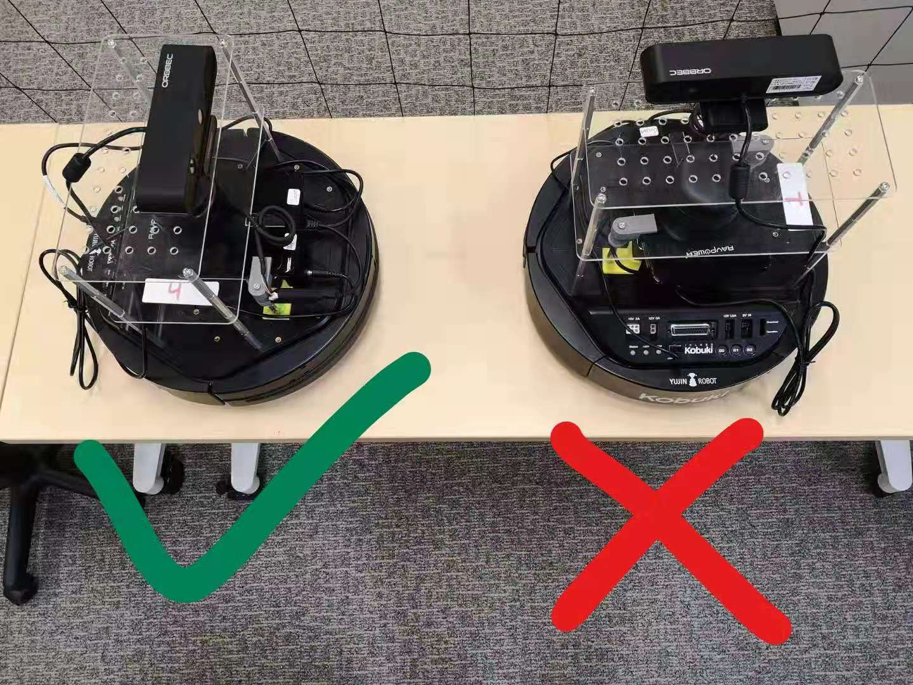

Logistics
=========

Welcome
-------

- Teaching Assistant: Hanzhe Teng
- Email: hteng007@ucr.edu
- Office Hour: Fri 11am-12pm at WCH 109

Please **feel free** to contact me if you have any questions/concerns. There is no stupid question.

Communications
--------------

Please consider reaching out to me in the following preferred order, regarding technical issues.

1. **Office Hour**. Please wisely use the time at office hour, where
   I can give detailed explainations. 
   You can also send me an email to make an appointment, if you cannot make it to office hour.

2. **Piazza**. It is said that Piazza makes office hour 24hr/7days for students.
   If you have any questions/concerns offline, please ask on Piazza first.

   + It is good for others who have the same/similar questions. 

   + We can use multimedia materials to interact on Piazza, rather than plain text in emails.

   + You may get good answers/helps from your classmates as well, which is encouraged.
   
   + You can also ask private questions on Piazza, which are only visible to instructors.

3. **Emails**. It is hard to discuss technical questions through emails.
   However, I will try to get back to you ASAP, unless I am traveling. 

Lab Section Style
-----------------

- Typically, lab tutorials and assignments will be posted on the website before lab starts.
  During lab section, you can work on these materials at your own pace, 
  and let me know if you have any questions. 

- Meanwhile, we will maintain two lists on the whiteboard, one for demo and the other for help.
  Please put your name on the corresponding list when needed. 
  I will take care of two lists alternately.
  It is good to organize things in this way because

  + It is good for me to remember your name.

  + It is fair for all students to get help on a first come first served basis.

  + I may not be available right at the time you raise up your hand 
    (e.g., may be working on fixing a bug that a previous student just pointed out).

Submission and Grading
----------------------

- In some labs, you are required to submit your code via iLearn. 
  Please also submit a lab report together with your script 
  and explain clearly your approach and your code. 
  A templete lab report will be provided.

- In some other labs, you are required to show demos to me. 
  During the demo, some questions may be asked to test your understanding
  of lab materials. Sample questions are given in the lab assignments.
  Please get prepared, otherwise you may lose points.

- Attendance is required for all labs. However, 
  you may leave early if you have completed all lab materials.
  Please sign in and sign out when you enter/leave lab room.
  (There is a sign in form near the door.) 
  This lab rule is enforced by the department.

- Lab assignments are typically due at 11:59pm one week after assigned, unless otherwise specified.
  Grading will be completed ASAP after submission. 
  You will get a detailed feedback indicating where you lose points and why.

Academic Integrity
------------------

Discussions are encouraged between teams/individuals for the purpose of 
having better understanding of lab materials. However, each of you (or your team)
has to work on your scripts independently after discussions. 
No copying of any form is allowed between each other. 

.. warning::

  All code submissions will be automatically checked for plagiarism in the system.
  If you borrowed some trivial modules/classes from the Internet,
  please mention this both in your code (by comments) and lab report.
  Any violation of the rules of academic integrity will result in 0 score in the lab assignment,
  and will be reported to the university.

Lab Safety
----------

#. Safety is always the top priority.

   - No food or beverage allowed in the lab.
   - Report any suspicious cables, wires, etc.

#. Organize your station before you leave.

   - **Cut off all power supply (both robot base and NUC)**.
   - Organize wires, cables, etc.

#. Do not leave your personal information on the robot.

   - Create your own folder when you work, and delete code when you leave.
   - The robot is shared by two lab sections.

#. Do NOT make any changes to the wiring on the robot.

#. Please find your station according to your team number. 

   - In Tuesday lab, your station/robot number is your team number.
   - In Thursday lab, your station/robot number is your team number minus 10.

#. Please save the battery (recharging takes time), 
   and charge the robot if you do not have it running.

#. Please place your robot in the following way to prevent it 
   from accidentally dropping down to the ground.

